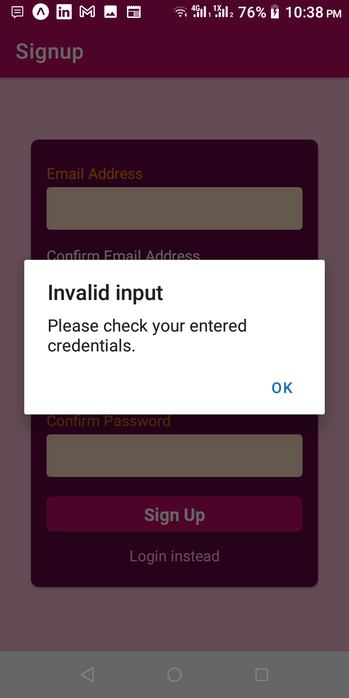

# Auth Project (using react-native)
A project to demonstrate authintcation in react-native based apps using JWT

## Screenshots

<div align="left">
    
    
    
    
</div>

## Environment variables
```sh
API_KEY
```

## Installed packages
```sh
yarn add @react-navigation/native
yarn add @react-navigation/native-stack

yarn add --dev react-native-dotenv

yarn add @react-native-async-storage/async-storage

yarn expo install expo-splash-screen
```